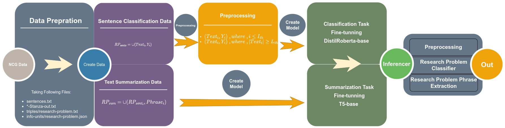
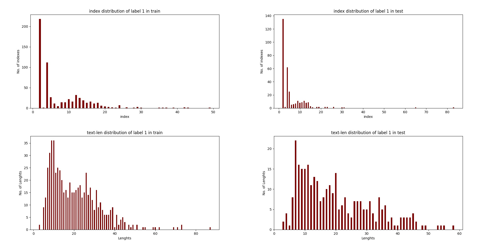

# NLPContributionGraph (NCG) Challenge


## 1. Introduction
[NLPContributionGraph](https://ncg-task.github.io/) challenge aim is to struct scholarly NLP contributions in the open research knowledge graph (ORKG). It posited as a solution to the problem of keeping track of research progress. The dataset for this task is defined in specific structure to be integrable within KG infrastructures such as ORKG.  It consist of the following informations:
1. `Contribution sentences`: A sentence about contributions from papers.
2. `Scientific terms and relations`: A set of scientific term or phrases from contribution sentences.
3. `Triples`: subject-predicate-object statements for KG constructions. The triples are orgnized under thre mandatory (*Research Problem, Approach, Model*) or more information units (IUs) (*Code, Dataset, Experimental Setup, Hyperparameters, Baselines, Results, Tasks, Experiments, and Ablation Analysis*).

In this work the major concern is `Research Problem` extraction. To do this, we need to find contribution sentences that contain `Research Problems` IU. Next, using the contribution sentences we may extract problems. To do this we designed a classifier that identifys contribution sentences with research problems (RPs), next a text summarizer to extracts RP phrases.

The rest of sections are ognized as follows. In section 2, we discused dataset prepration procedure for this task. The proposed method is described in section 3. The experimental setup and analysis is presented in section 4. The section 5 presents the observations and code instructions. Finally, in section 7 we concluded the report with possible future works..


## 2. Dataset Preprations
The proposed method to the task is two-fold: (1) a research problem classifier to identify research problem sentences, (2) a text summarizer to extract research problem phrases. Also, we only interested in extracting research problems so the resest of the data such as phrases and triples related to other IU are not relevent to this task. To only consider metada that is needed in this task we considered the following changes:
1. Considered `*-Stanza-out.txt` text files and ignored the other preprocessed text file and original pdf file. (for simplisity)
2. Considered only a `resarch-problem.JSON` file from `info-units` directory.
3. Changed `sentences.txt` content using `info-units/research-problem.json` file to consider indexes of sentences that contain researchp roblems.
4. Considered only a `resarch-problem.txt` file from `triples` directory.

The orignal dataset which presented in [NCG task training-data](https://github.com/ncg-task/training-data) and [NCG task test-data](https://github.com/ncg-task/test-data) converted into the following format. The transformed data exist in `dataset/preprocessed` directory. 
```
[task-name-folder]/                               
    ├── [article-counter-folder]/                 
    │   ├── [articlename]-Stanza-out.txt          
    │   ├── sentences.txt                         
    │   └── info-units/                           
    │   │   └── research-problem.json             
    │   └── triples/                              
    │   │   └── research-problem.txt              
    │   └── ...                                   
    └── ...
```
Next, to train models, we list all sentences in the train/test for research problem classifier. Next, we used `info-units/research-problem.json` file to build summarization data, where the phrases are the summary and the sentences are input texts to summarization service. These datasets are exist in `dataset/preprocessed/experiment-data` directory. The stats of the research problem classifier and research problem phrase extractions are as follows:

<!-- During data preprations we runned a preprocessings to avoid any complex modelings in future. So the data which construcuted for both tasks are preprocessed (which the preprocessin has been described in section 3 - proposed method).  -->

<table style='text-align:center;'>
  <tr>
    <td> <b>Tasks\Datasets</b> </td>
    <td colspan="3"><b>Training-data</b></td>
    <td colspan="3"><b>Test-data</b></td>
  </tr>
  <tr>
    <td>  </td>
    <td colspan="1"> Class-0 </td>
    <td colspan="1"> Class-1 </td>
    <td colspan="1"> All-data </td>
    <td colspan="1"> Class-0 </td>
    <td colspan="1"> Class-1 </td>
    <td colspan="1"> All-data </td>    
  </tr>
  <tr>
  <td>Research Problem Classifier</td>
    <td colspan="1"> 607 </td>
    <td colspan="1"> 54831 </td>
    <td colspan="1"> 55438 </td>
    <td colspan="1"> 316 </td>
    <td colspan="1"> 33639 </td>
    <td colspan="1"> 33955 </td>
  </tr>
  <tr>
    <td>Research Problem Classifier (preprocessed)</td>
    <td colspan="1"> 607 </td>
    <td colspan="1"> 9816 </td>
    <td colspan="1"> 10423 </td>
    <td colspan="1"> 314 </td>
    <td colspan="1"> 6501 </td>
    <td colspan="1"> 6815 </td>
  </tr>
    <tr>
    <td>Research Problem Summarization</td>
    <td colspan="3"> 602 </td>
    <td colspan="3"> 314 </td>
  </tr>
</table>

<b style='text-align:center;'>Table 1: Statistics of the dataset</b>

**Note**: `build_dataset.py` scripts is doing whole the dataset preprations with proposed method preprocessings.


## 3. Proposed System

The Figure-1 presents the proposed system architectures. After the data preprations, each task (sentence classification and text summarization) builds own data. For sentence classification task we made preprocessing which ended up of decreasing unwanted samples (stats presented in table-1) for fine-tuning transformer model for research problem sentence detection. For text summarization we fine-tuned T5 to summary research problem sentences.



<b style='text-align:center;'>Figure 1: Proposed System Architecture</b>

The preprocessing step and models described in the followings

#### 3.1 Preprocessing

The number of samples were too high for research problem classification part of the proposed system. To reduce the size of dataset we applied two thresholds over data based on hyperparameter tuning over train set.

**1) Maximum Index Threshold**: According to [J. D’Souza and S. Auer](http://ceur-ws.org/Vol-2658/paper2.pdf) effort in designing NCG dataset, most of the research problems come from title, abstract and introduction part of the paper. However, due to the variant in structure of papers it is hard to seprate these sections.

We made an analysis of the research problem indexes distributions to find appropiate number of samples from each documents to be considered for research problem classification. Here index is the no. of sentence that appeared in the paper to be research problem. 

The Figure-2 shows the distribution of research problem indexes in train and test set. To avoid any bias we select $I_{th} = 50$ where it is the maximum index threshold based on train set. Analysis of test set showed that we only losing 2 samples in train if we set threshold $I_{th} = 5$ however we reduce a significant amount of unwanted samples for training classifiers.


<b style='text-align:center;'>Figure 2: Distributions of research problem indexes and lenghts </b>

**2) Minimum Text Lenght Threshold**: Most of papers consist of sentences with a single word or multple words that in a few cases research problems are in group that higher than a specific words. To confirm the observations we plot the lenght of research problemts in train set. And according to these observations we used $T_{th} =  3$ as text lenght threshold. 

At the end, we obtained a very good shaped dataset for our classification task. The stats for the dataset is presented in `Table-1`. We reduced **train set by 82%** and **test set by 79%**. During the data reduction we only lost 2 samples in test set, however our models can be trained appropiately. The created datasets stored in `dataset/preprocessed/experiment-data` directory.


#### 3.2 Research Problem Classifier

#### 3.3 Research Problem Phrase Extraction


## 4. Results
### 4.1 Setups

- Metrics:
    - recall, precition, f1
    - talk about recall importance in classification here and why and what is the major goal?
- dataset


### 4.2 Evaluation

* https://github.com/ncg-task/scoring-program

- clf eval
- ie eval
- whole system eval


<table style='text-align:center;'>
  <tr>
    <td> <b>Models</b> </td>
    <td colspan="3"><b>Sentences</b></td>
    <td colspan="3"><b>Information Units</b></td>
    <td colspan="3"><b>Triples</b></td>
    <td colspan="1"><b>Average</b></td>
  </tr>
  <tr>
    <td><i> Metrics </i></td>
    <td colspan="1">F1</td>
    <td colspan="1">P</td>
    <td colspan="1">R</td>
    <td colspan="1">F1</td>
    <td colspan="1">P</td>
    <td colspan="1">R</td>
    <td colspan="1">F1</td>
    <td colspan="1">P</td>
    <td colspan="1">R</td>
    <td colspan="1">F1</td>
  </tr>
  <tr>
    <td>xgboost-t5small</td>
    <td colspan="1">0.281</td>
    <td colspan="1">0.604</td>
    <td colspan="1">0.183</td>
    <td colspan="1">0.609</td>
    <td colspan="1">1.0</td>
    <td colspan="1">0.438</td>
    <td colspan="1">0.173</td>
    <td colspan="1">0.385</td>
    <td colspan="1">0.112</td>
    <td colspan="1">0.355</td>
  </tr>
  <tr>
  <td>distilroberta-t5base</td>
    <td colspan="1">0.524</td>
    <td colspan="1">0.568</td>
    <td colspan="1">0.487</td>
    <td colspan="1">0.941</td>
    <td colspan="1">1.0</td>
    <td colspan="1">0.890</td>
    <td colspan="1">0.326</td>
    <td colspan="1">0.362</td>
    <td colspan="1">0.297</td>
    <td colspan="1">0.597</td>
  </tr>
</table>


## 5. Oservations && Code Instructions

### 5.1 Observations
### 5.2 Code Instructions


## 6. Future works
- Using title, abstract, and introductions only
- Classifier: Transformers 
- Classifier: GCN
- Group Rankings in sentence classificatons
- IE: keyword extraction 
- IE: topic modeling
- IE: NER *
- IE: summarization 


## Requirenments


### References
https://zenodo.org/record/1157185#.Yr4JZ9JBzeQ
http://ceur-ws.org/Vol-2658/paper2.pdf

1. https://ncg-task.github.io/
2. https://github.com/ncg-task
3. https://github.com/ncg-task/training-data
4. https://github.com/ncg-task/test-data
5. https://github.com/ncg-task/sample-submission